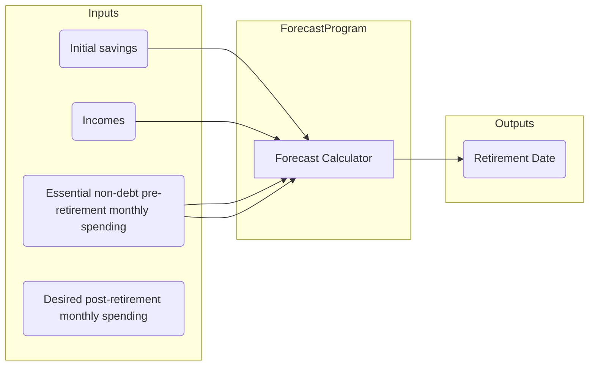

# finance-simulator

A tool for visually comparing various debt repayment strategies. Simply enter all your incomes and debts, create a few alternate repayment scenarios, and run the simulator to get a visualization of the various scenarios and evaluate which one will allow you to retire soonest.

## How the forecast works

Every month you have income from one or more sources. First you set aside a fixed amount of that money for critical non-debt spending (groceries, gas, electric bills, and ALL personal spending). The remainder of the money goes towards paying off debts. If there's any money left over (which there won't be until all the debts are paid off), then you put the remainder of the money into a savings account.

The date at which you can retire is calculated based off of how much spending money you want to have every month in retirement. This post-retirement spending money will be made up of a fixed withdrawal amount from your savings and/or payouts from your pension(s), depending on the scenario.

Your retirement date is the date at which you have saved up 25 times the annual spending amount that must come from savings. This is based on a 4% safe withdrawal rate. If a scenario says you will have a pension, that means your retirement savings threshold is lower. If a scenario says you don't get any pensions, then you need to save up the full 25X annual spending yourself.

## Assumptions

There are a lot of assumptions being made in this calculation.

1. ZERO new debt will be created. No more loans or credit card spending.
1. Each month, all of your take home pay will be split into 2 pools: money to be spent towards critical non-debt spending, and money to go towards paying off debts. The amount of dollars in critical non-debt spending is held fixed every single month until retirement.
1. After retirement, you will live off of a fixed dollar value you withdraw from savings and/or the sum of your pensions (depending on the scenario, you might not have any pensions)
1. You will work the same number of overtime hours every week (on average) from now until retirement
1. There's no limit to how much you can pay towards your mortgages. This is probably not true in real life.

## Analyzing the model results
(You have to use a mermaid-enabled markdown renderer to view this graph, GitHub doesn't support mermaid)


## Dev notes
### How to develop
Run `npm start` from the console, then `F5` in VS Code to debug which will launch a new browser window.
> Note: If you `npm install` any new package while you're debugging, you'll have to `ctrl-C` to kill the development server, then re-run `npm start` and restart the debugging session.

### Running Mocha tests
I found it's impossible to use the Mocha Test Explorer extension for vscode and React simultaneously. React requires that the tsconfig file have `compilerOptions.module` set to `esnext`, whereas the Moch Test Explorer extension requires that it be set to `commonjs`. If you want to run tests via the explorer, you'll have to manually set it back to `commonjs`. When you next run `npm start`, React will automatically set it back to `esnext`.

To debug the code, run `npm start` which will launch a browser window with the app in it, which you can immediately close. Then hit F5 in VS Code to start the debugger which will open another browser window which will be the one you actually use during debugging.

### Generating new components
`npx generate-react-cli component MyComponentName` will generate the css, test, and tsx file for a new component, based off of the custom template stored at `./templates/TemplateName.ts`. The settings for `generate-react-cli` tool are stored in `./generate-react-cli.json`

### react-plotly.js
This is a cool package that gives you a `<Plot/>` component, but you CANNOT use `import Plot from 'react-plotly.js';`, that will crash node when you try to `npm start`.
Instead, you have to use this boilerplate code in every component file where you want to insert a `Plot` component:
```TypeScript
import createPlotlyComponent from "react-plotly.js/factory";
const Plotly = window.Plotly;
const Plot = createPlotlyComponent( Plotly );
```
